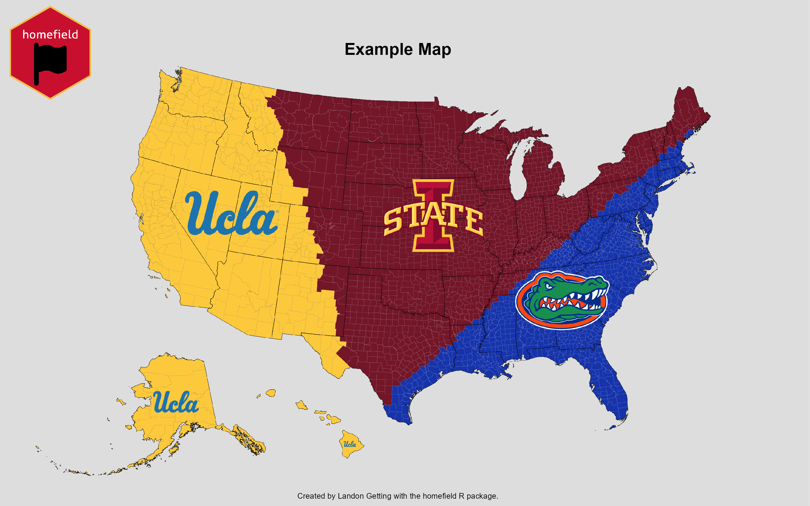
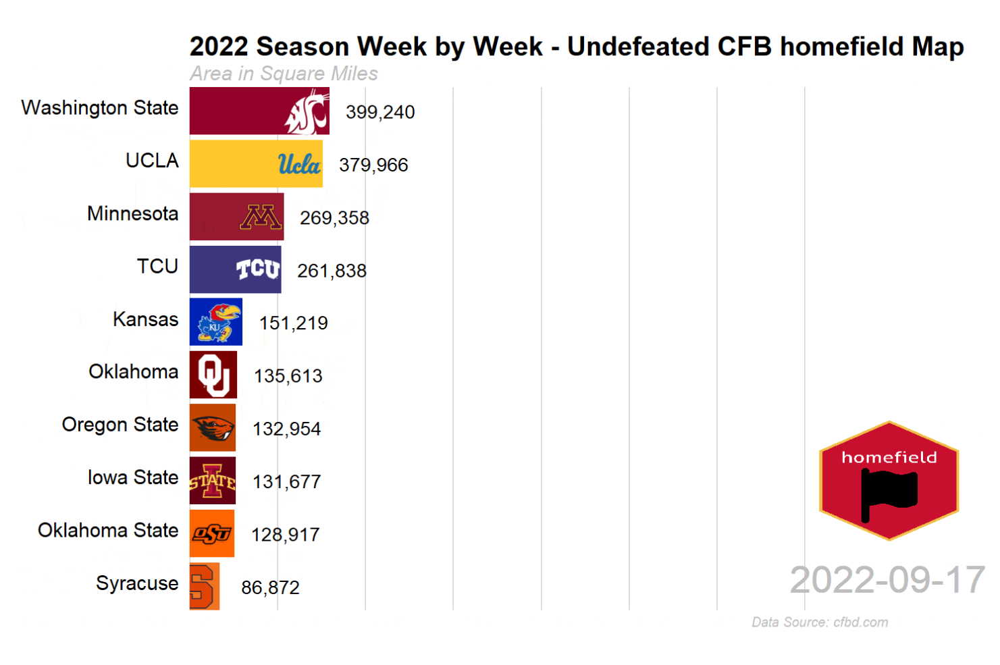
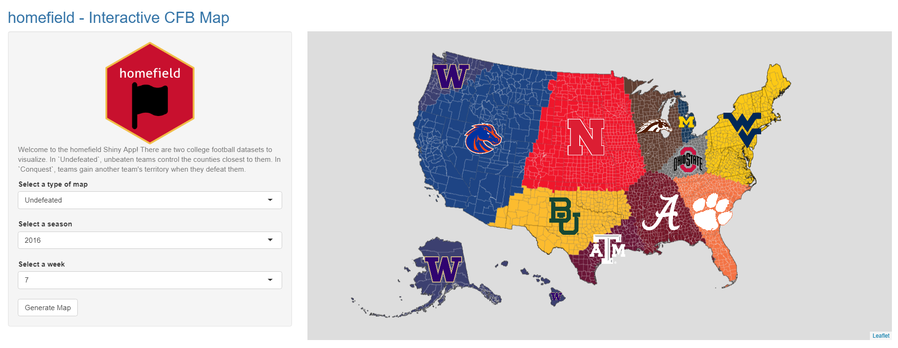

```{r figure_path, include=FALSE}
knitr::opts_chunk$set(
  fig.path = "man/figures/"
)
```

# homefield 

## Overview
The homefield package helps gather data and create visuals to show spatial relevance of entities.


## Installation

Install the package via GitHub:

```{r, eval = FALSE}
install_github("Landon-Getting/homefield")
```

Follow the directions [here](https://cfbfastr.sportsdataverse.org/#college-football-data-api-keys) to receive and install a College Football Data API Key. Required for `homefield::cfb_undefeated()` and `homefield::cfb_conquest()`.

Follow the directions [here](https://walker-data.com/tidycensus/reference/census_api_key.html) to receive and install a CENSUS API Key. Required for `homefield::homefield_stats()`.

## Authors

[Landon Getting](https://www.linkedin.com/in/landon-getting/)

Sudesh Bhagat

## homefield_map

homefield maps are created based on the attributes of **entities** including identifier, latitude, longitude, color, and image.

For example, a map may be composed of sport teams. The Iowa State Cyclones **entity** would have an entity identifier (`Iowa State`), a latitude (`42.0266573`), a longitude (`-93.6464516`), a color (`#C8102E`), and an image (`http://a.espncdn.com/i/teamlogos/ncaa/500/66.png`). 

A dataframe with multiple entities and their attributes may look similar to the following:

```{r, echo = FALSE, results = 'hide', message = FALSE, warning = FALSE}
devtools::load_all()
```

```{r}
entity <- c("Iowa State Cyclones", "Florida Gators", "UCLA Bruins")
lat <- c(42.01400, 29.64994, 34.16133)
lng <- c(-93.63577, -82.34858, -118.16765)
color <- c("#660015","#0021A5", "#ffc72c")
image <- c("http://a.espncdn.com/i/teamlogos/ncaa/500/66.png",
           "http://a.espncdn.com/i/teamlogos/ncaa/500/57.png",
           "http://a.espncdn.com/i/teamlogos/ncaa/500/26.png")

homefield_data <- data.frame(entity,
                             lat,
                             lng,
                             color,
                             image)

homefield_data
```
Next, the homefield map can be plotted with the dataframe and saved as a .png file to a specified location. 
```{r, eval = FALSE}
homefield_map(x = homefield_data, # dataframe
             output_file = "C:/Users/darthvader/Downloads/example_map.png", # save location
             title = "Example Map", # map title
             credit = "Landon Getting") # credit for author
```



The homefield package currently provides 2 functions to query interesting college football data directly into the necessary format: `cfb_undefeated()` and `cfb_conquest()`. Please see *Installation* for how to receive and install an College Football Database API key.

`cfb_undefeated()` returns a dataframe with the undefeated teams for a particular season and week. In `cfb_conquest()`, teams start with the land closest to them. As the season progresses, teams acquire the land of the teams they defeat. 

```{r, message = FALSE, warning = FALSE}
cfb_undefeated_s1999_w4 <- cfb_undefeated(season = 1999, week = 4)

head(cfb_undefeated_s1999_w4)
```

The dataframe output from `cfb_undefeated()` can be used directly in `homefield_map()`.

```{r, eval = FALSE}
homefield_map(x = cfb_undefeated_s1999_w4,
             output_file = "C:/Users/darthvader/Downloads/cfb_undefeated_s2022_w4.png",
             title = "College Football Undefeated - Season 1999 Week 4",
             credit = "Landon Getting")

```


## homefield_stats
`homefield_stats()` provides a dataframe with summary statistics about a particular map including the total land, water, and population within each entity's territory.

The same dataframe used in the `homefield_map()` example can be used in `homefield_stats()`.

```{r}
cfb_undefeated_s1999_w4_stats <- homefield_stats(x = cfb_undefeated_s1999_w4)

head(cfb_undefeated_s1999_w4_stats)

```
What are top 5 entities by population within their territory?

```{r}
dplyr::slice_max(cfb_undefeated_s1999_w4_stats, # output from homefield_stats()
                 order_by = pop, # sorting by population
                 n = 5) |> # top 5
  dplyr::select(entity, # selecting only entity and pop columns
                pop)
```
`homefield_stats()` can also create summary statistics for maps over time.

For example, `homefield_stats()` can be combined with `cfb_undefeated()` to show statistics over the course of a season. 

```{r, results = 'hide', message = FALSE, warning = FALSE}
# undefeated for each week, 0 through 15
cfb_undefeated_2022 <- list(cfb_undefeated(season = 2022, week = 0),
                            cfb_undefeated(season = 2022, week = 1),
                            cfb_undefeated(season = 2022, week = 2),
                            cfb_undefeated(season = 2022, week = 3),
                            cfb_undefeated(season = 2022, week = 4),
                            cfb_undefeated(season = 2022, week = 5),
                            cfb_undefeated(season = 2022, week = 6),
                            cfb_undefeated(season = 2022, week = 7),
                            cfb_undefeated(season = 2022, week = 8),
                            cfb_undefeated(season = 2022, week = 9),
                            cfb_undefeated(season = 2022, week = 10),
                            cfb_undefeated(season = 2022, week = 11),
                            cfb_undefeated(season = 2022, week = 12),
                            cfb_undefeated(season = 2022, week = 13),
                            cfb_undefeated(season = 2022, week = 14),
                            cfb_undefeated(season = 2022, week = 15))

# date of each week
cfb_dates_2022 <- lubridate::ymd(c("2022-08-27",
                                   "2022-09-03",
                                   "2022-09-10",
                                   "2022-09-17",
                                   "2022-09-24",
                                   "2022-10-1",
                                   "2022-10-8",
                                   "2022-10-15",
                                   "2022-10-22",
                                   "2022-10-29",
                                   "2022-11-5",
                                   "2022-11-12",
                                   "2022-11-19",
                                   "2022-11-26",
                                   "2022-12-3",
                                   "2022-12-10"))

cfb_undefeated_2022_stats <- homefield_stats(x = cfb_undefeated_2022,
                                  temporal = cfb_dates_2022,
                                  keep_max = FALSE,
                                  keep_visuals = TRUE)

```

```{r}
# converting land from square meters to square miles
cfb_undefeated_2022_stats <- cfb_undefeated_2022_stats |>
  dplyr::mutate(land = land/2.59e6)

head(cfb_undefeated_2022_stats)

```

The dataframe output has summary statistics for each team and week. In this example, the population within Alabama's territory increases throughout the season.

```{r}
cfb_undefeated_2022_stats |>
  dplyr::filter(entity == "Alabama") |>
  dplyr::select(entity, pop, time) |>
  head()
```

## homefield_racing
`homefield_racing()` can help visualize the state of homefield maps over time. `homefield_stats()` and `cfb_undefeated()` can be leveraged to develop a dataframe for `homefield_racing()`.

```{r, eval = FALSE}
homefield_racing(x = cfb_undefeated_2022_stats,
                stat_name = "land",
                title = "2022 Season Week by Week - Undefeated CFB homefield Map",
                subtitle = "Area in Square Miles",
                caption = "Data Source: cfbd.com",
                output_file = "C:/Users/darthvader/Downloads/cfb_undefeated_2022_racing.gif")
```



## homefield_shiny
`homefield_shiny()` showcases several functions from the homefield package in an interactive application. Users can choose a type of map, season, and week and the homefield map will be automatically generated.


## Acknowledgements
Created as a part of Dr. Heike Hofmann's STAT 585 at Iowa State University. 

*Inspired by [u/CaptainScuttlebottom](https://www.reddit.com/user/CaptainScuttlebottom/) and [u/jloose128](https://www.reddit.com/user/jloose128/) on Reddit*
