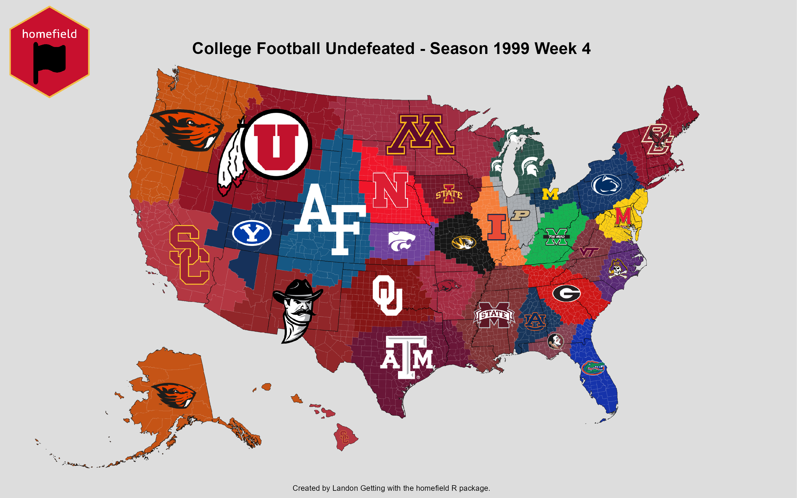

# homefield

## Overview

Creates visualize representation of entities by region. 

## Installation

Install the package via GitHub:

```{r, eval = FALSE}
install_github("Landon-Getting/homefield")
```

Follow the directions [https://cfbfastr.sportsdataverse.org/#college-football-data-api-keys](here) to receive and install a College Football Data API Key. Required for `homefield::cfb_undefeated()` and `homefield::cfb_conquest()`.

Follow the directions [https://walker-data.com/tidycensus/reference/census_api_key.html](here) to receive and install a CENSUS API Key. Required for `homefield::homefield_stats()`.

## homefield_map

homefield maps are created based on the attributes of **entities** including identifier, latitude, longitude, color, and image.

For example, a map may be composed of sport teams. The Iowa State Cyclones **entity** would have an entity identifier (`Iowa State`), a latitude (`42.0266573`), a longitude (`-93.6464516`), a color (`#C8102E`), and an image (`http://a.espncdn.com/i/teamlogos/ncaa/500/66.png`). 

A dataframe with multiple entities and their attributes may look similar to the following:

```{r}
entity <- c("Iowa State Cyclones", "Florida Gators", "UCLA Bruins")
lat <- c(42.01400, 29.64994, 34.16133)
lng <- c(-93.63577, -82.34858, -118.16765)
color <- c("#660015","#0021A5", "#ffc72c")
image <- c("http://a.espncdn.com/i/teamlogos/ncaa/500/66.png",
           "http://a.espncdn.com/i/teamlogos/ncaa/500/57.png",
           "http://a.espncdn.com/i/teamlogos/ncaa/500/26.png")

homefield_data <- data.frame(entity,
                             lat,
                             lng,
                             color,
                             image)

homefield_data
```
Next, the homefield map can be plotted with the dataframe and saved as a .png file to a specified location. 
```{r eval = false}
homefield_map(x = homefield_data, # dataframe
             output_file = "C:/Users/lwget/Downloads/example_map.png", # save location
             title = "Example Map", # map title
             credit = "Landon Getting") # credit for author
```


The homefield package currently provides 2 functions to query interesting college football data directly into the necessary format: `cfb_undefeated()` and `cfb_conquest()`. Please see *Installation* for how to receive and install an College Football Database API key.

`cfb_undefeated()` returns a dataframe with the undefeated teams for a particular season and week. In `cfb_conquest()`, teams start with the land closest to them. As the season progresses, teams acquire the land of the teams they defeat. 

```{r}
cfb_undefeated_s1999_w4 <- homefield::cfb_undefeated(season = 1999, week = 4)

head(cfb_undefeated_s1999_w4)
```
The dataframe output from `cfb_undefeated()` can be directly used in `homefield_map()`.

```{r}
homefield_map(x = cfb_undefeated_s1999_w4,
             output_file = "C:/Users/lwget/Downloads/cfb_undefeated_s2022_w4.png",
             title = "College Football Undefeated - Season 1999 Week 4",
             credit = "Landon Getting")

```


## homefield_stats

## homefield_racing

## homefield_shiny

# WORK IN PROGRESS BELOW

## Input Data Frame:


## Output:

Territory map where each element is represented on a map by the closest regions (counties/states/countries) to the input lat and long. This calculation is performed based on the centroid of each region. Regions are colored based on provided colors in column of the data frame. The image from each element is placed into its respective territory. The image does not touch the boundaries of the territory and fits inside nicely.

## Acknowledgements

## Use Cases:

**Athletic -** What teams or individuals are currently undefeated and who is their closest geographic competition?

**Economic -** Where is the closest wholesale store to each US county (Sam's Club vs CostCo)?

**Commerical -** Show the LinkedIn headshot for the closest sales rep to each state.

**Political -** What is the closest private high school to each Minnesota county? What is the closest public high school to each Wisconsin county?

*Inspired by [u/CaptainScuttlebottom](https://www.reddit.com/user/CaptainScuttlebottom/) and [u/jloose128](https://www.reddit.com/user/jloose128/) on Reddit*
