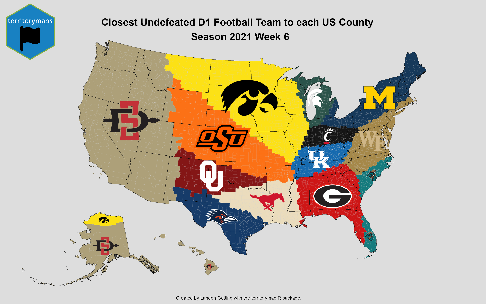

---
output:
  html_document: default
---
# territorymap
Creates territory maps to visualize representation by region.

## Example Map

## Input Data Frame:

| Identifier | Latitude | Longitude | Color | Image |
| ----------- | ----------- | ----------- | ----------- | ----------- |
| Dodgers | 42.501171 | -94.169388 | #bf250d | C:/Users/darthvader/Documents/PlotPictures/Dodgers.jpg |
| Little Cyclones | 42.501171 | -94.169388 | #eda01a | C:/Users/darthvader/Documents/PlotPictures/Little-Cyclones.jpg |
| Rams | 42.501171 | -93.464610 | #ffe924 | C:/Users/darthvader/Documents/PlotPictures/Rams.jpg |

## Output:
Territory map where each element is represented on a map by the closest regions (counties/states/countries) to the input lat and long. This calculation is performed based on the centroid of each region. Regions are colored based on provided colors in column of the data frame. The image from each element is placed into its respective territory. The image does not touch the boundaries of the territory and fits inside nicely.

## Use Cases:

**Athletic -** What teams or individuals are currently undefeated and who is their closest geographic competition?

**Economic -** Where is the closest wholesale store to each US county (Sam's Club vs CostCo)?

**Commerical -** Show the LinkedIn headshot for the closest sales rep to each state.

**Political -** What is the closest private high school to each Minnesota county? What is the closest public high school to each Wisconsin county?

*Inspired by [u/CaptainScuttlebottom](https://www.reddit.com/user/CaptainScuttlebottom/) and [u/jloose128 ](https://www.reddit.com/user/jloose128/) on Reddit*

